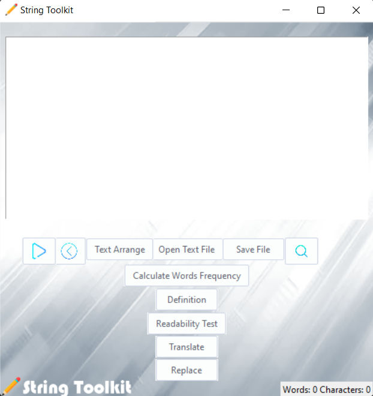

# String Toolkit
This is a utility program that analyzes and manipulates text. It can read text files, translate text, find & replace in text, arrange text, test the text's readability with a Dale-Chall, Gunningfog, and Flesch scores and lookup a word's definition.

